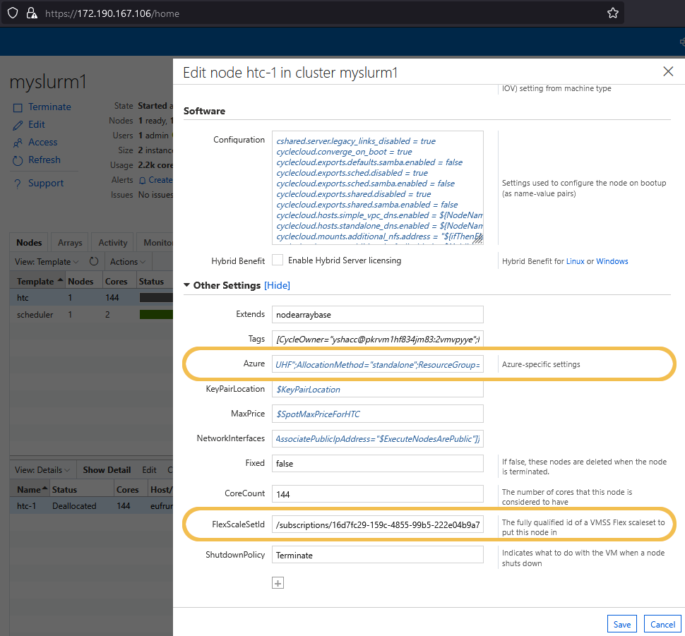

# Using the WebUI to Scale CycleCloud Clusters to a Thousand InfiniBand-Connected Nodes

## Outline

- [Section 1 - Introduction](#section-1---introduction)
- [Section 2 - Pre-requisites](#section-2---pre-requisites)
    - [Section 2.1 - Create an Empty VMSS Flex Scale Set](#section-21---create-an-empty-vmss-flex-scale-set)
    - [Section 2.2 - Set Up Additional Settings in WebUI](#section-22---set-up-additional-settings-in-webui)
- [Section 3 - Conclusion](#section-3---conclusion)

## Section 1 - Introduction

The purpose of this blog post is to demonstrate how to scale your existing CycleCloud cluster to reach a thousand InfiniBand-connected nodes using the WebUI. InfiniBand is a high-speed interconnect technology that provides excellent performance for High-Performance Computing (HPC) workloads. By leveraging the Azure VMSS (Virtual Machine Scale Set) Flex and CycleCloud's powerful orchestration capabilities, you can achieve unprecedented scalability, deployment performance, and reliability for your HPC workloads.

## Section 2 - Pre-requisites

Before proceeding with the scaling process, ensure you meet the following pre-requisites:

* An existing CycleCloud cluster.
* Access to the WebUI, which requires the host VM to have an "allow web requests" Network Security Group (NSG) rule.

If you do not have an existing CycleCloud cluster or access to the WebUI, don't worry! We've got you covered. Check out our guide on [how to set up a CycleCloud cluster with up to a thousand InfiniBand-nodes from scratch](../cyclecloud-flex-ib/) to get started.

## Section 2.1 - Create an Empty VMSS Flex Scale Set

To begin, create an empty VMSS Flex scale set within the resource group hosting the cluster resources. Use the Azure CLI command below to create the scale set:

```bash
az vmss create \
    -n <vmss_name> \
    -g <rg_name> \
    --platform-fault-domain-count 1 \
    --orchestration-mode Flexible \
    --single-placement-group false
```

Replace `<vmss_name>` with the desired name for your VMSS and `<rg_name>` with the name of the resource group containing your CycleCloud cluster resources.

## Section 2.2 - Set Up Additional Settings in WebUI

Now, let's configure the HTC (Heterogeneous Compute) partition using the WebUI of your deployed CycleCloud cluster. Follow these steps:

1 - Log in to your Azure portal and navigate to your CycleCloud cluster deployment.

2 - Access the WebUI for your CycleCloud cluster.

3 - Locate and select the HTC partition.

4 - Edit the partition and add the following additional settings:

   - Key: `Azure`
     Value: `=[AllocationMethod='StandAlone']`

   - Key: `FlexScaleSetId`
     Value: `/subscriptions/{subscription-id}/resourceGroups/{resource-group-name-for-the-cyclecloud-cluster}/providers/Microsoft.Compute/virtualMachineScaleSets/{vmss-name}`

Replace `{subscription-id}` with your Azure subscription ID, `{resource-group-name-for-the-cyclecloud-cluster}` with the name of the resource group containing your CycleCloud cluster resources, and `{vmss-name}` with the name of the VMSS you created in step 1.

Image 1: Editing the WebUI Settings to Change the Allocation Mode and Include the VMSS Flex Scale Set ID


For more information on additional settings, you can visit the [Microsoft Azure CycleCloud documentation](https://learn.microsoft.com/en-us/azure/cyclecloud/cluster-references/node-nodearray-reference?view=cyclecloud-8#additional-attributes).

## Section 3 - Conclusion

In conclusion, using Azure VMSS Flex to scale CycleCloud clusters with InfiniBand connectivity provides a robust solution for handling demanding HPC workloads. Leveraging VMSS flexibility and InfiniBand's high-speed interconnect technology allows for unprecedented scalability, performance, and reliability.

The combination of CycleCloud's orchestration capabilities, Azure's scalable infrastructure, and InfiniBand's advanced technology opens up new possibilities for efficient large-scale simulations, data analytics, and scientific research. Embracing these solutions empowers organizations to stay at the forefront of HPC, driving remarkable discoveries and breakthroughs.

If you do not meet the pre-requisites or need help setting up a CycleCloud cluster, you can follow this guide to [set up a CycleCloud cluster with up to a thousand InfiniBand-connected nodes from scratch](../cyclecloud-flex-ib/).
