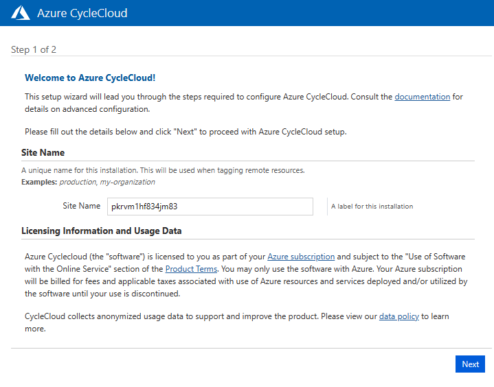
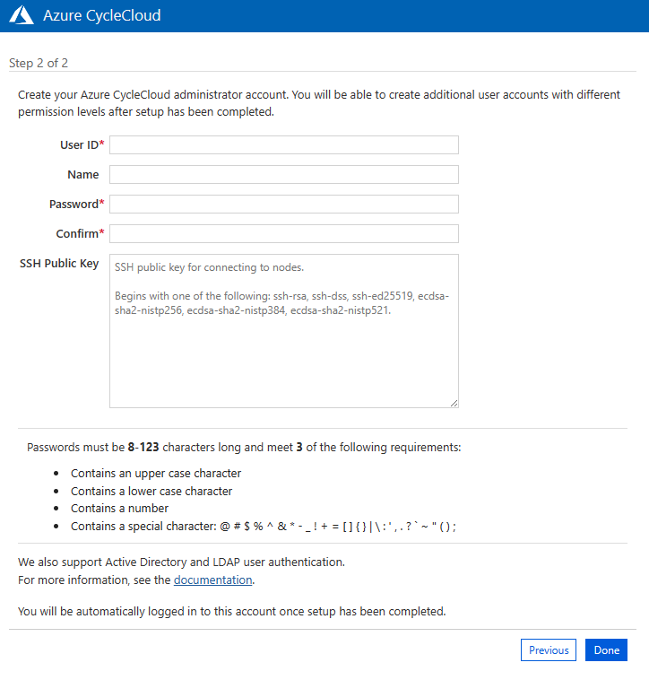

# Leveraging Azure CycleCloud to Scale HPC Workloads with Over a Thousand InfiniBand-Connected Nodes

## Outline

- [Section 1 - Introduction](#section-1---introduction)
- [Section 2 - Setting Up the Environment for CycleCloud Cluster](#section-2---setting-up-the-environment-for-cyclecloud-cluster)
- [Section 3 - Installing and Configuring CycleCloud](#section-3---installing-and-configuring-cyclecloud)
- [Section 4 - Scaling Out the SLURM Cluster within a VMSS Flex with InfiniBand](#section-4---scaling-out-the-slurm-cluster-within-a-vmss-flex-with-infiniband)
- [Section 5 - Conclusion](#section-5---conclusion)


## Section 1 - Introduction

In the world of high-performance computing (HPC), scaling out clusters to meet demanding computational needs is a crucial aspect. Azure CycleCloud, a cloud-based HPC management solution, provides a powerful platform for orchestrating and scaling HPC workloads. In this blog post, we will explore how to scale out a CycleCloud SLURM cluster on Azure VMSS Flex, leveraging InfiniBand connectivity. This configuration not only enhances scalability but also improves deployment performance and reliability, making it an ideal choice for embarrasingly parallel HPC and AI worloads.

The next sections provide a step-by-step explanation on how to set up the environment for CycleCloud, how to configure CycleCloud, and how to scale out CycleCloud into a VMSS Flex + IB.

## Section 2 - Setting Up the Environment for CycleCloud Cluster

It takes about eight steps to set up the environment for a CycleCloud cluster. These steps ensure you have a working CycleCloud VM host before setting up a cluster to leverage InfiniBand with VMSS Flexible.
This section introduces the main variables and walks you through each of the eight steps, which include: creating a resource group, creating a virtual network, creating a default subnet, creating a CycleCloud Host VM, assigning a contributor role to the host VM managed identity, setting an NSG rule to allow web requests, creating a VMSS, and creating a storage account. You will also find a few extra steps for creating a Bastion public IP, a Bastion subnet, and a Bastion service to securely SSH into the host VM.

The variables include:

```shell
set -e

RG=$1
LOCATION=$2
SUBSCRIPTION="REPLACE_WITH_AZURE_SUBSCRIPTION_ID"
IMAGE="azurecyclecloud:azure-cyclecloud:cyclecloud8:latest"
SKU="REPLACE_WITH_AZURE_VM_SIZE"
HOST_VM_NAME="$RG-host-vm"
VMSS_NAME="$RG-flex-vmss"
STORAGE_ACCOUNT="ccstoragelocker"
```

For CycleCloud cluster deployment environment to be up and running, you need the entire script to run successfully. Hence, `set -e` ensures that the script exit whenever any of the commands fail.

Optionally, you can add control flow statements *prior to the variables declaration block* to check whether the first (`$1`) and second (`$2`) arguments have been omitted.

```shell
if [ -z "$1" ]; then
  echo "Please provide the resource group name as the first argument."
  exit 1
fi

if [ -z "$2" ]; then
  echo "Please provide the location as the second argument."
  exit 1
fi
```

### Section 2.1 - CycleCloud Host VM Deployment Steps

1 - Create the resource group: The resource group will include the host VM, the VMSS, and all the shared resources (e.g., network, storage, etc.).

  ```bash
  az group create \
      -n $RG \
      -l $LOCATION \
      --subscription $SUBSCRIPTION
  ```

2 - Provision the virtual network: This will facilitate network connectivity for your CycleCloud cluster.

  ```bash
  az network vnet create \
      --name $RG-vnet \
      --address-prefixes "10.0.0.0/16" \
      --resource-group $RG
  ```

3 - Add a subnet to the virtual network: The default subnet will help with IP address allocation for the host VM and subsequent nodes in the CycleCloud cluster.

  ```bash
  az network vnet subnet create \
    --address-prefixes "10.0.0.0/22" \
    --name "default" \
    --vnet-name $RG-vnet \
    --resource-group $RG
  ```

4 - Creating the CycleCloud host VM: Set up the CycleCloud host VM, which serves as the control or management node for the cluster.

  ```bash
  az vm create \
    -n $HOST_VM_NAME \
    -g $RG \
    --image $IMAGE \
    --public-ip-sku Standard \
    --size $SKU \
    --admin-username "azureuser" \
    --ssh-key-value "REPLACE_WITH_PUBLIC_KEY_DATA" \
    --vnet-name $RG-vnet \
    --subnet "default" \
    --assign-identity \
    --plan-name "cyclecloud8" \
    --plan-publisher "azurecyclecloud" \
    --plan-product "azure-cyclecloud"
  ```

5 - Assign contributor role to the host VM managed identity: This grants the necessary permissions allowing the control node to create compute nodes and associated resources.

  ```bash
  # Get Host VM Principal ID
  hostVMPrincipalID=$(az vm show \
                            -g $RG \
                            -n "$HOST_VM_NAME" \
                            --query "identity.principalId" \
                            -o tsv)

  # Assign contributor role to the host VM
  az role assignment create \
      --assignee-principal-type ServicePrincipal \
      --assignee-object-id $hostVMPrincipalID \
      --role "Contributor" \
      --scope "/subscriptions/$SUBSCRIPTION"   
  ```

6 - Setup network security group rules: Enable web access to CycleCloud through the WebUI by defining network security group rules.

  ```bash
  # Get the NSG Name
  nsgName=$(az network nsg list  \
                  -g $RG \
                  --query '[0].name' \
                  -o json | jq -r '.')

  # Set NSG Rule to Allow Web Requests
  az network nsg rule create \
          --nsg-name $nsgName  \
          -g $RG \
          -n "allow-web-req" \
          --destination-port-ranges 80 443 \
          --access Allow \
          --protocol Tcp \
          --priority 107
  ```

7 - Deploy an empty VMSS Flex: The CycleCloud cluster will later scale out from within this VMSS using RDMA-enabled VM sizes to ensure InfiniBand connectivity between the nodes.

  ```bash
  az vmss create \
    -n "$VMSS_NAME" \
    -g $RG \
    --platform-fault-domain-count 1 \
    --orchestration-mode Flexible \
    --single-placement-group false
  ```

8 - Create the storage account: Establish a storage account that will serve as the CycleCloud storage locker, ensuring data persistence and accessibility across the nodes in the cluster.

  ```bash
  az storage account create \
          -n $STORAGE_ACCOUNT \
          -g $RG \
          --sku Standard_LRS
  ```

### Section 2.2 - Accessing the Host VM Securely through Bastion Service

To ensure secure access to the CycleCloud host VM terminal, we'll deploy a bastion service. This service enables convenient and protected SSH connectivity to the host VM, without the need for a public IP address or VPN connection.

```bash
# Create bastion public IP
az network public-ip create \
  --name $RG-bastion-public-ip \
  --resource-group $RG \
  --sku Standard \
  --allocation-method Static

# Create bastion subnet
az network vnet subnet create \
  --address-prefixes "10.0.4.0/24" \
  --name "AzureBastionSubnet" \
  --vnet-name $RG-vnet \
  --resource-group $RG

# Deploy bastion
az network bastion create \
  --name $RG-bastion \
  --public-ip-address $RG-bastion-public-ip \
  --resource-group $RG \
  --vnet-name $RG-vnet \
  --enable-tunneling true
```

At this stage, you are ready to connect to the CycleCloud host VM using bastion. The command below utilizes the `az network bastion ssh` command to establish an SSH connection to the host VM within the specified resource group (`$RG`) using Azure Bastion. It authenticates with an SSH key by pointing to the location of the private key associated with the public key used when creating CycleCloud host VM and using the username `azureuser`.

```bash
# Get the host VM resource ID
cc_host_vm_id=$(az vm show \
                    --name $HOST_VM_NAME \
                    -g $RG \
                    --query 'id' \
                    -o json | jq -r '.')

# SSH into the VM
az network bastion ssh \
  --name $RG-bastion \
  --resource-group $RG \
  --target-resource-id $cc_host_vm_id \
  --auth-type ssh-key \
  --username azureuser \
  --ssh-key "/path/to/.ssh/id_rsa.pem"
```

## Section 3 - Installing and Configuring CycleCloud

Now that the environment is prepared, we can proceed with installing and configuring CycleCloud on the CycleCloud host VM. This step lays the foundation for managing and scaling HPC workloads effectively.

1 - Retrieve the public IP of the CycleCloud host VM and install the CycleCloud CLI on the host VM:

```bash
az vm show -d \
      -g $RG \
      -n $HOST_VM_NAME \
      --query 'publicIps' \
      -o json | jq -r '.'
```

You can substitute the public ip from above in the following command and paste this command on the VM terminal to download the CLI:

```bash
wget --no-check-certificate https://<REPLACE_WITH_PUBLIC_IP>/static/tools/cyclecloud-cli.zip
```

Then unzip and install CycleCloud CLI on the host VM:

```bash
unzip cyclecloud-cli.zip && sh cyclecloud-cli-installer/install.sh
```


Image 1: CycleCloud WebUI Initial Landing Page


2 - Configure an initial account and initialize CyCleCloud:

To set up an initial account, you can navigate to the following URL: `https://<REPLACE_WITH_PUBLIC_IP>` from a web browser. This will open up the WebUI and ask to confirm the credential, as shown in Image 1.

Next, you can set up a account, password, and public key (the one used during the provisioning of the host VM), as per Image 2.

Once you hit done, close (or leave) the browser window.


Image 2: Initial User Setup from CycleCloud WebUI

From the host VM terminal, run the command below to initialize CycleCloud:

```bash
cyclecloud initialize
```

Follow the prompt, filling out the details as provided in Table 1.

| Prompt                                          | Value                          |
|-------------------------------------------------|--------------------------------|
| CycleServer URL:                                | http://localhost               |
| Detected untrusted certificate.  Allow?:        | yes                            |
| CycleServer username:[azureuser]                | The username from WebUI        |
| CycleServer password:                           | Their corresponding password   |
| Subscription Name:                              | Any custom name^1              |
| Cloud Environment:                              | public                         |
| Managed Identity:                               | y                              |
| Subscription ID:                                | Azure subscription ID          |
| Default Location:                               | (`$RG`) resource group region  |
| Resource Group:                                 | Value of the `$RG` variable    |
| Storage Account:                                | Value of `$STORAGE_ACCOUNT`    |
| Use storage account?                            | y                              |
| Storage Container:                              | cyclecloud                     |
| Marketplace Terms:                              | y                              |
|-------------------------------------------------|--------------------------------|

Table 1: Description of Prompt-Value Pairing During CycleCloud Initialization


3 - Add the storage account key to the config file:

The command below will retrieve the storage account key:

```bash
az storage account keys list \
            --account-name $STORAGE_ACCOUNT \
            -g $RG \
            --query "[0].value" \
            -o json | jq -r '.'
```

You can subsequently replace the storage account name and key in the below configuration excerpt:

```
[azure]
storage_account = <REPLACE_WITH_STORAGE_ACCOUNT_NAME>
storage_account_key = <REPLACE_WITH_STORAGE_KEY>
```

The above excerpt can thus be pasted in the config file inside of the host VM by executing the command below, or through any other Linux text editing means.

```bash
vi /home/azureuser/.cycle/config.ini
```

4 - Add the private key for authentication: 

To set up the private key in the host VM, use the key associated with the public key from the initial user setup in the WebUI.

```bash
# Create a file and paste the private key content
vi private-key.pem

# Move the file to the .ssh directory
mv private-key.pem ~/.ssh/cyclecloud.pem 

# Set the appropriate permissions
chmod 600 ~/.ssh/cyclecloud.pem
```

5 - Import the SLURM template to leverage CycleCloud `StandAlone` allocation method:

This will scale out the cluster inside of a Virtual Machine Scale Set (VMSS) in Flexible orchestration mode with InfiniBand connectivity.

Follow the link below to download the template file on your local machine and copy its content over to the host VM.

[Download CycleCloud_FlexIB_SLURM_Template.txt](./assets/CycleCloud_FlexIB_SLURM_Template.txt)

To keep the template minimal, the parameters are in the following separate JSON file:

[Download CycleCloud_FlexIB_SLURM_Parameters.json](./assets/CycleCloud_FlexIB_SLURM_Parameters.json)


Alternatively, you could use `wget` to download these files directly on the host VM:

```bash
# Download the template file
wget https://skyv04.github.io/drafted-blog-posts/cyclecloud-flex-ib/assets/CycleCloud_FlexIB_SLURM_Template.txt

# Download the parameter file
wget https://skyv04.github.io/drafted-blog-posts/cyclecloud-flex-ib/assets/CycleCloud_FlexIB_SLURM_Parameters.json
```

## Section 4 - Scaling Out the SLURM Cluster within a VMSS Flex with InfiniBand

1 - Import the SLURM template: 

```bash
cyclecloud import_cluster myslurm1  -f CycleCloud_FlexIB_SLURM_Template.txt -c slurm -p CycleCloud_FlexIB_SLURM_Parameters.json
```

The above command is to be run within the host VM in the directory where the template and parameter files are found.

> :information_source: Before executing the above command, ensure that you modify the parameter file to include all the necessary values. You would replace any missing values that have placeholders starting with `REPLACE_WITH_...` such as the CycleCloud subscription, subnet ID, VMSS Flex ID, etc.


2 - Launch the cluster:

```bash
# Start the cluster
cyclecloud start_cluster myslurm1 

# Monitor the provisioning status of the head node
watch cyclecloud show_cluster myslurm1 -l

```

3 - Add nodes to the cluster: 

```bash
cyclecloud add_nodes myslurm1 --template htc --count 1000
```

The above command adds a thousand RDMA-enabled nodes to the SLURM cluster in the HTC partition. You would make sure the number of nodes does not exceed the maximum HTC scale out size that was specified in the parameter file.

4 - Monitor the status of the cluster:

In case the `watch` command under point (1 -) above was interrupted or does not show a complete list of the newly added nodes, you might need to re-run it to see the full list of nodes and monitor their provisioning status.

You can also use the Azure portal or the CLI to check the status of the VMSS Flex inside of the `$RG` resource group the status of the added nodes.

The above point (3 -) is merely scaling out the cluster without any useful HPC workload. As a remedy, you may skip that command and directly submit a slurm job from the head node:

```bash
# Connect to the head node from the host VM
cyclecloud connect <node-name> -c <cluster-name>

# Prepare a batch MPI job specifying the partition as HTC, the number of nodes (as 1000), the script to run, etc. 
[...]

# Submit the job
sbatch myjob.sh
```

This too will scale out the HTC partition to a 1000 InfiniBand-connected nodes. It is also reflective of the actual usage scenario you would commonly encounter.

## Section 5 - Conclusion

Scaling out a CycleCloud SLURM cluster with InfiniBand connectivity using Azure VMSS Flex provides a robust solution for handling demanding HPC workloads. By leveraging the flexibility of VMSS and the performance benefits of InfiniBand, HPC developers, scientists, and technical experts can achieve unprecedented scalability, deployment performance, and reliability.

The combination of CycleCloud's powerful orchestration capabilities, Azure's scalable infrastructure, and InfiniBand's high-speed interconnect technology opens up new possibilities for tackling complex computational tasks efficiently. Whether it's running large-scale simulations, data analytics, or scientific research, this setup empowers users to achieve even more than was currently possible for HPC use cases on Azure.

As HPC continues to evolve and demand grows for more computational power, leveraging technologies like CycleCloud, Azure, and InfiniBand becomes increasingly critical. Embracing these advanced solutions can enable organizations to stay at the forefront of scientific research, engineering simulations, and data-driven decision-making, with the urge to attain remarkable discoveries and breakthroughs!

